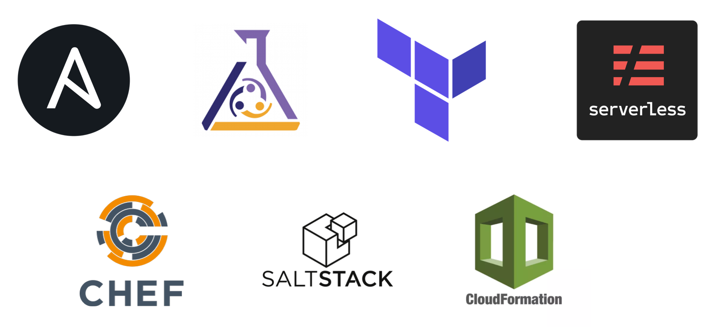
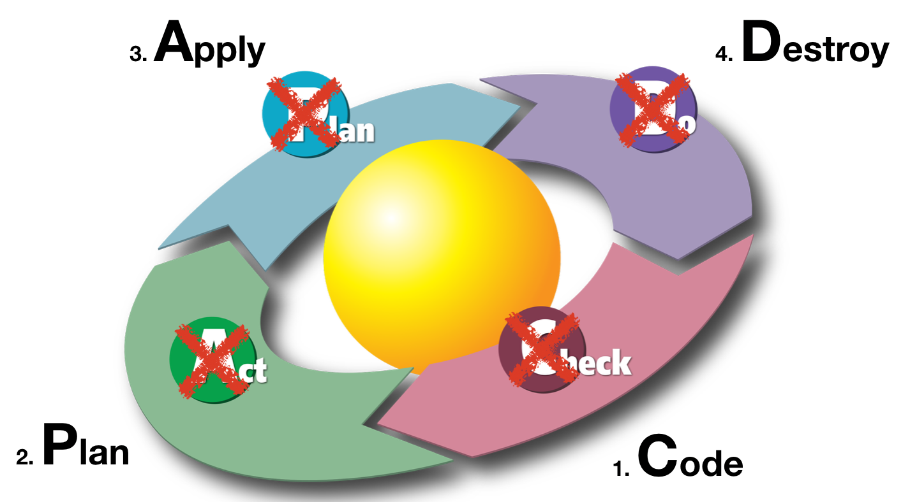
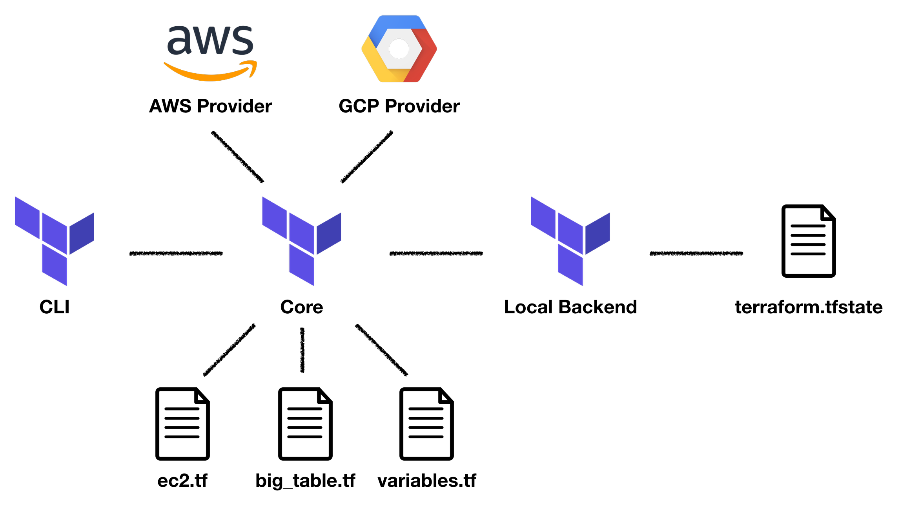

# Infrastructure as Code with Terraform

## Frank Rosner (IT Consultant [@codecentric](https://www.codecentric.de/))

Twitter: [@FRosnerd](https://twitter.com/FRosnerd)
GitHub: https://github.com/FRosner
Blog: https://dev.to/FRosnerd

---

# Table of Contents

1. Infrastructure as Code
2. Terraform Basics
3. Terraform in Action

---

# Table of Contents

1. **Infrastructure as Code**
2. Terraform Basics
3. Terraform in Action

---

# Infrastructure as Code

## Concept

- Desired infrastructure state in declarative definition files
- Software adjusts state based on current and desired

## Properties

- Version control => audit, rollback, versioning, ... #gitops
- Allows high degree of automation
- Enables reproducibility, speed, and quality of deployments

---

# Infrastructure as Code

## Tooling

- imperative vs. declarative
- push vs. pull
- configuration management vs. orchestration management

	

---

# Table of Contents

1. Infrastructure as Code
2. **Terraform Basics**
3. Terraform in Action

---

# Terraform Basics

## Workflow

1. Code desired infrastructure state
2. **Plan** infrastructure changes to make reality match
3. **Apply** plan
   ...
5. **Destroy** infrastructure 
 
 
 

---

# Terraform Basics

## Architecture

---

# Table of Contents

1. Infrastructure as Code
2. Terraform Basics
3. **Terraform in Action**

---

# Terraform in Action

## Demo

https://dev.to/frosnerd/infrastructure-as-code---managing-aws-with-terraform-i9o